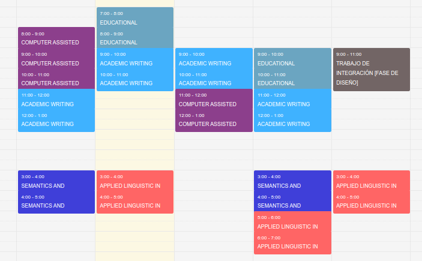

- # Pages
	- [[Matter 1]]
	- [[Matter 2]]
-
- # Data
- | **Name** | **Target** | **Status** | **Date** | **File** |
  |---|---|---|---|---|
  | Example | General | Published | [[February 21st, 2022]] | |
  | Example | Complementary | Unpublished | [[January 11th, 2022]] |  |
  | Example | Subject file | Closed | [[November 15th, 2021]] | [File](https://airtable.com/apps72izQvQXzFDV4/tblHDnSvxYydNWAZT/viwH7AFqrE8TWCeDW?blocks=hide) |
-
-
- # Class workflow
- | **Monday** | **Tuesday** | **Wednesday** | **Thursday** | **Friday** |
  |--|--|--|--|--|
  | 7-9am FREE | 7-9am FREE | 7-9am FREE | 7-9am FREE | 7-9am FREE |
  | 9-11am FREE | 9-11am FREE | 9-11am ACADEMIC WRITING | 9-11am FREE | 9-11am FREE |
  | 11-1pm FREE | 11-1pm FREE | 11-1pm COMPUTER ASSISTED| 11-1pm FREE | 11-1pm FREE |
  | 1-3pm NOON | 1-3pm NOON | 1-3pm NOON | 1-3pm NOON | 1-3pm NOON |
  | 3-5pm FREE | 3-5pm FREE | 3-5pm FREE | 3-5pm FREE | 3-5pm FREE |
  | 5-7pm FREE | 5-7pm FREE | 5-7pm FREE | 5-7pm FREE | 5-7pm FREE |
  | 7-9pm FREE | 7-9pm FREE | 7-9pm FREE | 7-9pm FREE | 7-9pm FREE |
- 
-
- # Resources
- | **Name** | **File** |
  |---|---|
  | Enrollment | [Resources](Resources%205723371ad27d4afa81a79d4b18aaf599/Registro_de_Matrcula.pdf) |
  | Subject record | [Resources](Resources%205723371ad27d4afa81a79d4b18aaf599/Registro_de_Matrcula.pdf) |
-